<div align="center">

# Profile

**Inference diagnostics for production vLLM servers.**

*Less words. Less noise. More signal. More value.*

[Get started](#get-started) · [What is Profile](#what-is-profile) · [The engine](#the-engine) · [Proof](#proof) · [Docs](#documentation) · [Website](https://jungledesh.github.io/profile/index.html)

</div>

---

**Are you getting what your hardware is capable of?**

One RTX 5090. Muse Glimmer 30B. SWE-Bench agents. Same hardware, different flags.

```text
  Throughput          81 → 421 tok/s          5.2x
  Cost/1M output tok  $3.41 → $0.65 (est)     81% lower
```

- Profile named each bottleneck, gave the flag, measured the delta after every change.
- A few iterations, not days of guessing. Regressions included. [Walk the steps.](docs/journeys.html#5090-1) [Watch the run.](https://www.youtube.com/watch?v=gdrXGgfa7lA&t=39s) [More recorded runs below.](#proof)

```text
✓ Single binary      ✓ No agent to deploy
✓ No config file     ✓ Nothing leaves the server
```

---

## What is Profile

A **diagnostic loop**. Profile turns opaque inference into deterministic engineering. Reproducible: same server, same traffic, same verdict.

The value is time. You close the gap in a few measured iterations instead of guessing for days.

```text
guessing:   metrics ---------------------------> you -> try a flag -> wait
profile:    metrics -> physics ceiling -> cause -> fix -> re-measure
```

- **The question it answers:** what is this setup capable of, what is it delivering, and which flag closes the gap?
- **Ceiling.** Computes the fastest your GPU can serve your model, from memory bandwidth and FLOPs. Physics, not vibes.
- **Cause.** Compares the live server against that ceiling and names the one cause holding it back.
- **Fix.** Gives you the exact vLLM flag. You apply it. Profile never touches your server.
- **Proof.** Re-measures, prints the delta, labels regressions `worse`.

```text
✗ Not a dashboard      it reasons, not just reports
✗ Not an autotuner     no restarts, no synthetic load
✗ Not a simulator      reads the server you actually run
```

Stack comparison: [docs/positioning.md](docs/positioning.md).

---

## Get started

vLLM on one GPU, `/metrics` reachable, live traffic. Then:

1. Install.

    ```bash
    curl --proto '=https' --tlsv1.2 -LsSf \
      https://github.com/jungledesh/profile/releases/latest/download/profile-installer.sh | sh
    ```

2. Diagnose. Default window is `30s`. Raise it when traffic repeats inside the window ([shapes](docs/workflow.md#duration-and-traffic-shape)).

    ```bash
    profile diagnose --url http://localhost:8000/metrics --duration 30s
    ```

3. Apply the Fix. Press Enter. Read the delta. Repeat until the loop names a wall or goes quiet.

No calibration run. Profile never restarts your server.

- **Idle server?** No waste to find; Profile says so. Drive load with `vllm bench serve`.
- **No curl-pipe?** Binary from the [releases page](https://github.com/jungledesh/profile/releases/latest), or `cargo install --git https://github.com/jungledesh/profile`.
- **NVIDIA or AMD.** Single GPU; TP > 1 refused ([roadmap](docs/roadmap.md)).
- **Every flag and output line:** [docs/workflow.md](docs/workflow.md).

---

## The engine

Profile's engine. Deterministic engineering. Reproducible.

<p align="center">
  
</p>

- **Eight rules, eight failure modes.** On a struggling server, several fire at once.
- **Mutual exclusivity** removes symptoms another cause already explains. Weights overflowing VRAM? Then KV pressure is a symptom, and treating it would be malpractice. Profile fires the real cause instead, with its own fix.
- **Priority DAG:** fix what is broken before tuning what is healthy. A tuning tip can never outrank an active bottleneck.
- **One primary survives.** A wall of alerts carries the same information as no alert.
- **Nothing is discarded.** Losing rules are held, and surface exactly when they become the next hypothesis.
- **Evidence of harm, never heat.** 95% KV with no evictions and no queue is a healthy, busy server. Profile stays quiet.

The full machinery: [docs/engine.md](docs/engine.md).

---

## The loop

1. **Diagnose.** One cause, its evidence, its threshold, the flags to change.
2. **Apply.** You restart vLLM with the flag. Profile waits, reconnects on its own.
3. **Delta.** Before → after on every metric that matters. Regressions labelled, not buried.

Real output, shortened (RTX 5090 Muse Glimmer 30B run; full blocks in [docs/workflow.md](docs/workflow.md)):

```text
|PROFILE v2.2.1 [muse-glimmer-30b] [NVIDIA GeForce RTX 5090]           |
|GPU =>    decode_eff ~3.5% | $2.10/1M output tok (est) | vRAM 29/32GB |
|REQUESTS  run 9 (27.4%) | wait 15 | max 32                             |
|CACHE     kv_cache 88.6% avg (99.9% peak)                             |
|THROUGHPUT 131 tok/s                                                  |
|                                                                      |
|[!] KV Cache Pressure          Seen in 100% of windows                |
|    Cause: KV cache 89% avg, 100% peak (threshold: 88%).              |
|           Scheduler evicting; 15 requests queued on KV admission.    |
|    Fix:   • Raise --gpu-memory-utilization.                          |
|           • Switch --kv-cache-dtype fp8.                             |
|           • Lower --max-model-len 32768 → 21933. Observed p99 21.9k. |
|    Expected: TTFT and TPOT recover once evictions stop.              |
|    Confidence: High                                                  |
```

```text
Measuring delta...

  Config changed. Baseline reset.

  Throughput          174 → 401 tok/s
  TTFT                44157 → 239ms (p95 77146 → 604ms)
  Cost/1M output tok  $1.58 → $0.69 (est)
```

- A dash means Profile could not read it.
- `(est)` means the physics model, not the server.
- A tilde marks a value derived from an estimated ceiling.
- Gaps are never filled with guesses.

---

## Proof

```text
                                                                       tok/s
                                                                       
5090   before  |████████ 81
       after   |██████████████████████████████████████████ 421         5.2x

       
H100   before  |█████████████████████████ 257
       after   |████████████████████████████████████████████████ 490   1.9x
```

- **RTX 5090 · Muse Glimmer 30B (NVFP4):** 5.2x throughput, 81% lower cost, $3.41 to $0.65 per 1M tokens. SWE-Bench agents. Ended quiet, capped by vLLM overhead. [Walk the steps.](docs/journeys.html#5090-1) [Watch the run.](https://www.youtube.com/watch?v=gdrXGgfa7lA&t=39s)
- **H100 80GB HBM3 · Qwen3.8-27B:** 1.9x throughput, 48% lower cost, TTFT 1.9s to 539ms. Same agent swarm. Path: 257, 278, 490 tok/s. The flood step labelled `worse` (TTFT 172s), then the flags recovered it. [Walk the steps.](docs/journeys.html#h100-1) [Watch the run.](https://www.youtube.com/watch?v=w15RezkRijM)
- That honesty is why the wins are believable.
- A server already near its ceiling has nothing to recover, and Profile tells you that instead of manufacturing a recommendation.

---

## Documentation

We did the hard part: a deterministic core engine. These pages show the work.

- **[Get started](docs/workflow.md#get-started)**
  Install, diagnose, apply the fix, read the delta. Then every flag and output line.
  Run a full session from this page.

- **[Engine](docs/engine.md)**
  The ceiling math from first principles, all eight rules with their fire conditions and fixes, suppression and ranking.
  Thresholds and edge cases in depth: [website Rules](https://jungledesh.github.io/profile/docs.html#rules).

- **[Research](docs/research.md)**
  Profile is not heuristics. The ceiling is a roofline, the field's standard. The engine descends from Intel's Top-down analysis, a decade in `perf` and VTune. The loop is Coz-style causal perturbation, run as a side effect of normal use.
  We also list every known weakness of each method ourselves, with citations, before you find them.

- **[Positioning](docs/positioning.md)**
  The full serving stack, and a straight comparison against dashboards, kernel profilers, autotuners, and simulators.
  Ends with the only honest column that matters: who measures whether the fix worked.

- **[Limitations](docs/limitations.md)**
  Every boundary, stated plainly, with the reason it exists.
  Shorter than you fear, and nothing hidden in it.

- **[Roadmap](docs/roadmap.md)**
  Multi-GPU, calibrated ceilings, more engines, and the end state: a server that heals itself.
  Demand reorders it: [tell us what you run](https://github.com/jungledesh/profile/issues).

Deep reference on the [website](https://jungledesh.github.io/profile/docs.html): rule thresholds and edge cases, metric sources, the math, the GPU catalog, and engine design.

---

## Principles

The tool follows these rules:

- Every number is measured or marked with either `(est)` or `~`. A missing metric prints `-`. Nothing is invented.
- One cause at a time. Eight rules, one primary.
- Regressions are named, never buried. A tool that only reports wins cannot be trusted when it reports one.
- Every character earns its place. If it does not help you act, it is not there.
- No jargon. We write to help, not to confuse.
- Crafted, not just engineered. Every byte Profile allocates is taken from the model it profiles, so we delete before we add. A profiler that eats its target is worse than no profiler.

---

## Contributing, license, contact

- **Contributing:** new rules, engine ports, catalog entries, bug reports from real servers.
  Code map: [ARCHITECTURE.md](ARCHITECTURE.md).
  Build, merge gate, rule checklist: [CONTRIBUTING.md](CONTRIBUTING.md).
- **License:** [Apache 2.0](LICENSE). Copyright 2026 Gagandeep Singh.
- **Contact:** need cluster aggregation, multi-engine support, or a custom hardware catalog?
  [Open an issue](https://github.com/jungledesh/profile/issues) or email [jungledesh@gmail.com](mailto:jungledesh@gmail.com).

---

<div align="center">

**We show what your server hides.**

*The end state: servers that heal themselves, bottlenecks surfaced by physics, no human in the loop.*

*Until then: close the gap between what you pay for and what your hardware delivers.*

</div>

